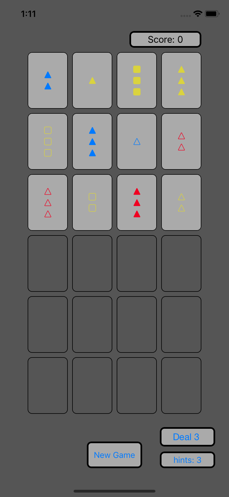
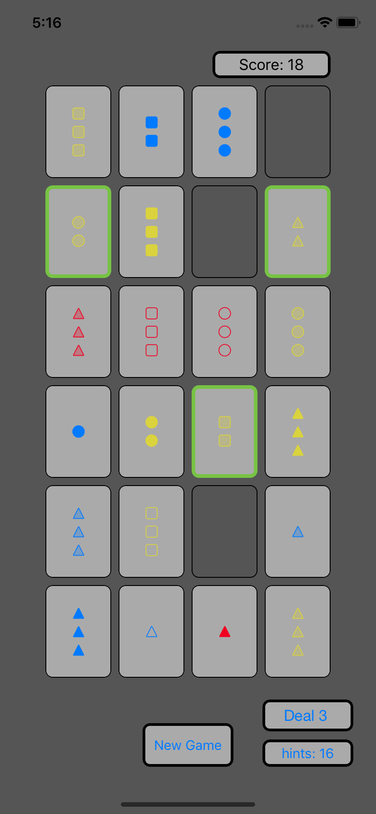
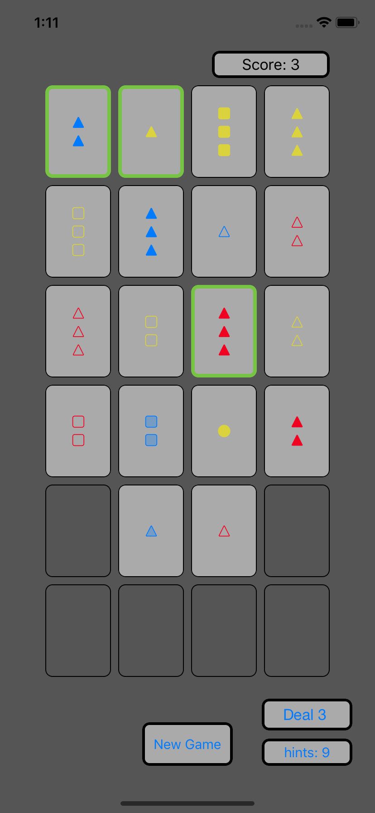
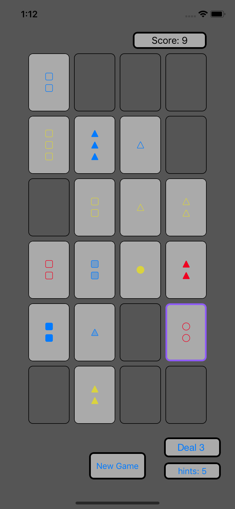

# Set
Set Card game.
The mathematics game of set.
The deck consists of 81 unique cards that vary in four features across three possibilities: 
number of shapes (one, two, or three), 
shape (triangle, square, ball), 
shading (solid, striped, or open), 
and color (yellow, blue, or red).
[1] Each possible combination of features (e.g., a card with [three] [striped] [blue] [square]) appears 
as a card precisely once in the deck.

In the basic game, three cards make up a "set", which a player collects by making sure each of those three cards 
has exactly the same matching feature or else all have a different feature. 
If two cards match in one of the four features, but the third card does not, then the three cards are not a "set" 
and the player is penalized instead of being able to collect.

